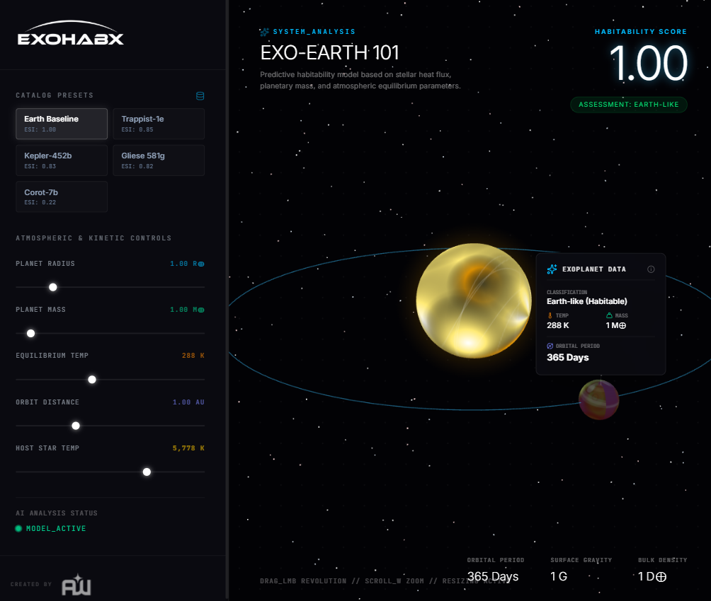
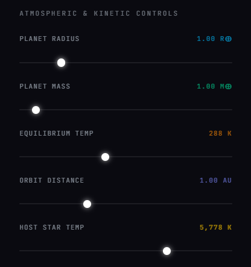
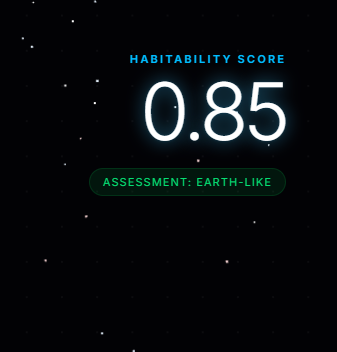
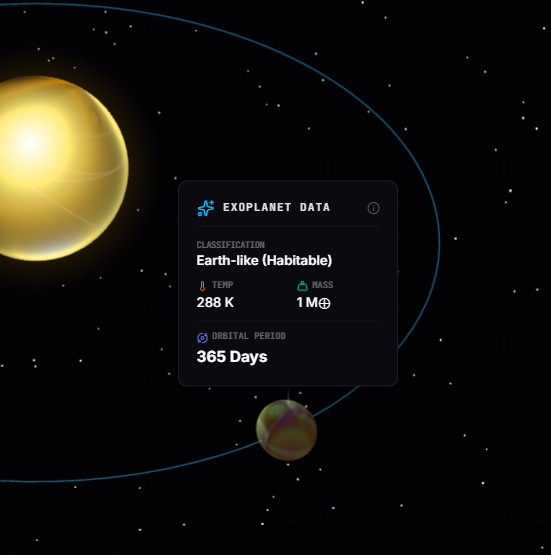

# 
### **@Astrowalid**

### **Interactive Exoplanet Habitability Simulator & AI Predictor**

---

## 🌌 The Mission

**ExoHabX** is a next-generation astrophysical simulator designed to visualize and predict the habitability potential of distant worlds. By integrating real-time **Keplerian physics** with **Advanced Machine Learning**, we provide an immersive window into planetary systems light-years away.

---

## 🚀 Key Features

### 💎 3D Immersive Visualization
Experience distant star systems with procedurally generated planet textures and accurate orbital mechanics powered by **Three.js**.
- **Dynamic Starfields:** Explore an infinite cosmic background.
- **Atmospheric Rendering:** Visual representations of planetary heat and composition based on temperature.
- **Orbital Paths:** Accurate Keplerian paths relative to host star mass and distance.

### 🧠 AI-Driven Habitability Scoring
Utilizes a custom-trained **Scikit-Learn** model to calculate the **Earth Similarity Index (ESI)** in real-time.
- **Predictive Modeling:** Analyze mass, radius, and temperature to determine life-supporting potential.
- **Live Feedback:** Instant score updates as you adjust planetary parameters.

### 📚 Exoplanet Catalog
Includes a library of known exoplanet presets, including **Earth**, **Proxima Centauri b**, and the **TRAPPIST-1** system.

---

## 🕹️ Operation Guide

| **1. Configure** | **2. Analyze** | **3. Interact** |
| :--- | :--- | :--- |
|  |  |  |
| Adjust planetary mass, radius, and orbital distance using the **Control Deck**. | Monitor the real-time **AI Assessment Score** to evaluate Earth-similarity. | Click on celestial bodies to open **Interactive Data Labels** and explore metrics. |

---

## 🛠️ Tech Stack

- **Frontend:** React (TypeScript), Three.js (React Three Fiber), Tailwind CSS, Lucide Icons.
- **Backend:** Flask (Python), Scikit-Learn (Model Inference), Joblib.
- **Environment:** Docker-ready for cross-platform consistency.

---

## 📄 License

This project is licensed under the **MIT License** - see the [LICENSE](LICENSE) file for details.

---

## 👨‍🔬 Developed By

**ExoHabX © 2026**
*Astrophysical Exploration Systems*
**@Astrowalid**
