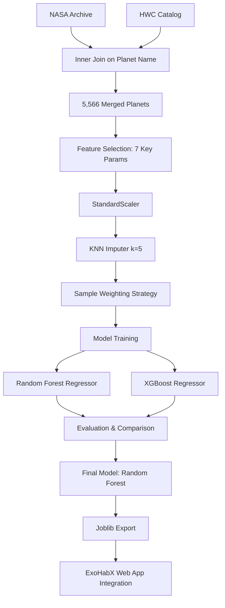

# 🔬 ExoHabX: AI-Driven Habitability Research
### **Predicting the Earth Similarity Index (ESI) with Sparse Observational Data**


[](exoplanet.ipynb)
[](https://www.kaggle.com/datasets/walididbennacer/exohabx-habitable-exoplanets-dataset-nasa-hwc)
[](ai_astrobiologist_model.pkl)

---

## 📌 Problem Statement
The **Earth Similarity Index (ESI)** is a crucial metric for astrobiologists to identify potentially habitable worlds. However, calculating the ESI using the standard geometric mean formula requires a complete set of planetary parameters (radius, mass, temperature, etc.) that are frequently missing from astronomical surveys due to observational constraints.

**The Question:** Can we train a machine learning model to accurately predict the ESI score of an exoplanet even when several of its physical parameters have not been directly measured?

---

## 🌌 Scientific Background: What is ESI?
The Earth Similarity Index is a multi-parameter scale ranging from **0 (completely dissimilar)** to **1 (Earth-identical)**. It is calculated based on:
1. **Interior properties:** Mean Radius and Bulk Density.
2. **Surface properties:** Escape Velocity and Surface Temperature.

The formula typically used is:
$$ESI = \prod_{i=1}^{n} \left(1 - \left| \frac{x_i - x_{i0}}{x_i + x_{i0}} \right|\right)^{w_i/n}$$
Where $x_i$ is a planetary property, $x_{i0}$ is Earth's value for that property, and $w_i$ is the weight of that parameter.

---

## 📊 Dataset & Strategy

### Sources
*   **NASA Exoplanet Archive:** 6,291 planets, 84 columns (High-fidelity orbital data, missing ESI).
*   **Habitable Worlds Catalog (HWC):** 5,599 planets, 118 columns (Includes ESI labels).

### Merge Strategy
We performed an **inner join** on the `planet_name` column, resulting in a curated dataset of **5,566 planets** where we have both NASA's detailed astronomical features and the HWC's ESI ground truth labels.

> [!TIP]
> The merged and cleaned dataset used for this research is available on [Kaggle](https://www.kaggle.com/datasets/walididbennacer/exohabx-habitable-exoplanets-dataset-nasa-hwc).

---

## 🛠️ Machine Learning Pipeline



### Features Table
| Feature | Description | Importance |
| :--- | :--- | :--- |
| `P_RADIUS` | Planet Radius (Earth Units) | High |
| `P_MASS` | Planet Mass (Earth Units) | High |
| `P_TEMP_EQUIL` | Equilibrium Temperature (K) | Critical |
| `P_DISTANCE` | Orbital Distance (AU) | Medium |
| `P_ECCENTRICITY` | Orbital Eccentricity | Medium |
| `S_TEMP` | Host Star Temperature (K) | Medium |
| `S_NUM` | Number of Stars in System | Low |

---

## 🏆 Model Performance & Selection

To handle the significant class imbalance (rare Earth-like planets vs. abundant gas giants), we applied a custom **Sample Weighting** strategy:
*   **ESI > 0.5:** 5x Weight
*   **ESI > 0.8:** 20x Weight

### Comparison Table
| Metric | Random Forest (Final) | XGBoost |
| :--- | :---: | :---: |
| **Mean Absolute Error (MAE)** | **0.02337** | 0.02396 |
| **R² Score** | 0.8767 | **0.8795** |
| **Classification Accuracy** | **98.12%** | 97.94% |
| **Training Speed** | Fast | Moderate |

### Why Random Forest won?
While XGBoost showed a slightly higher R² score, the **Random Forest Regressor** was selected as the production model for ExoHabX because:
1.  **Lower MAE:** It provided more precise ESI predictions on a per-planet basis.
2.  **Higher Accuracy:** It achieved superior performance in classifying planets into habitability categories.
3.  **Generalization:** It showed less variance when dealing with the high-imputation data typical of real-world exoplanetary observations.

---

## ⚙️ Installation & Usage

### 1. Prerequisites
```bash
pip install pandas numpy scikit-learn xgboost joblib matplotlib seaborn
```

### 2. Run the Notebook
Open `exoplanet.ipynb` in your preferred Jupyter environment to reproduce the training and evaluation steps.

### 3. Load the Model
```python
import joblib

# Load the trained AI Astrobiologist
model = joblib.load('ai_astrobiologist_model.pkl')
scaler = joblib.load('data_scaler.pkl')

# Example Prediction
# [Radius, Mass, Temp, Distance, Eccentricity, StarTemp, StarNum]
features = [[1.0, 1.0, 288, 1.0, 0.016, 5778, 1]]
scaled_features = scaler.transform(features)
predicted_esi = model.predict(scaled_features)
print(f"Predicted ESI: {predicted_esi[0]:.4f}")
```

---

## 🌍 Why This Matters
In the search for life beyond Earth, we are often limited by "blind spots" in our data. By leveraging AI to fill these gaps, we can prioritize which planets deserve the most attention from next-generation telescopes like **JWST**. This model turns sparse data into actionable astronomical insights, moving us one step closer to finding another Earth.

---

## 🔗 Quick Links
*   **Web App:** [ExoHabX Live](https://astrowalid-exohabx.hf.space)
*   **Source Code:** [GitHub Repository](https://github.com/Astrowalid/ExoHabX)
*   **Dataset:** [Kaggle Dataset](https://www.kaggle.com/datasets/walididbennacer/exohabx-habitable-exoplanets-dataset-nasa-hwc)
*   **Primary Sources:** [NASA Exoplanet Archive](https://exoplanetarchive.ipac.caltech.edu/) | [PHL Habitable Worlds Catalog](https://phl.upr.edu/hwc/data)

---
**Developed by @Astrowalid | 2026**
